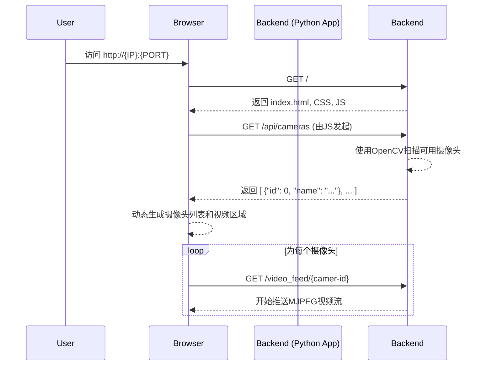

# 产品需求文档 (PRD) - 本地网络监控

## 1. 产品路线图 (Product Roadmap)

**核心目标 (Mission):**
让任何拥有摄像头的闲置电脑，都能轻松变为一个零成本、易于使用的本地网络监控中心。

**用户画像 (Persona):**
*   **技术爱好者与DIY玩家:** 他们喜欢探索、动手实践，希望通过技术手段解决实际问题，并乐于利用现有设备创造新价值。
*   **个人用户:** 可能有临时、轻度的监控需求（例如，照看宠物、监控门口），但不想为此投入额外的硬件成本和复杂的设置。
*   **核心痛点:** 拥有闲置的带摄像头电脑，但缺乏简单、直接的方法将其转变为监控设备。市面上的专业方案要么成本高，要么设置过于复杂。

**V1: 最小可行产品 (MVP):**
*   **自动摄像头发现:** 程序启动时，能自动检测并识别连接到电脑上的所有摄像头设备。
*   **可配置的Web服务:** 用户可以自定义服务器的IP地址和端口，以便在局域网内稳定访问。
*   **实时视频流:** 在Web界面上，能够同时展示所有已发现摄像头的实时视频画面。
*   **极简Web UI:** 提供一个干净、直观的网页，网格化布局平铺展示所有摄像头画面，无需任何复杂操作。

**V2 及以后版本 (Future Releases):**
*   **安全访问:** 增加用户登录认证机制。
*   **互联网远程访问:** 通过内网穿透或云服务，实现从外网访问监控画面。
*   **智能录制:** 基于移动侦测 (Motion Detection) 触发视频录制。
*   **事件通知:** 当侦测到移动时，通过邮件或App推送发送警报。
*   **录像管理:** 提供一个时间线界面，方便用户查看和管理录制的视频片段。
*   **多设备管理:** 从一个主界面管理多个运行此软件的监控端。

**关键业务逻辑 (Business Rules):**
1.  **启动:** 后端Python程序启动。
2.  **配置加载:** 读取配置文件获取用户设定的IP地址和端口号（若无则使用默认值）。
3.  **设备扫描:** 程序扫描并列出所有可用的视频硬件设备（例如 `camera 0`, `camera 1`...）。
4.  **服务开启:** 在指定的IP和端口上启动一个Web服务器。
5.  **视频流化:** 为每一个发现的摄像头创建一个独立的视频流传输路径（例如 `/video_feed/0`, `/video_feed/1`）。
6.  **前端加载:** 用户通过浏览器访问主页。
7.  **画面展示:** 前端页面请求并渲染所有可用的视频流，将它们平铺展示出来。

**数据契约 (Data Contract):**
*   **后端 -> 前端:**
    *   `GET /api/cameras`: 返回一个JSON数组，包含所有发现的摄像头信息。
        *   `[{ "id": 0, "name": "Integrated Webcam" }, { "id": 1, "name": "USB Camera" }]`
    *   `GET /video_feed/<camer-id>`: 返回一个多部分响应 (multipart response)，持续推送该摄像头的MJPEG格式视频流。
*   **用户 -> 后端:**
    *   配置文件 (`config.ini` 或类似): 包含 `HOST = '192.168.1.100'` 和 `PORT = '8080'` 等字段。

---

## 2. MVP 原型设计 (V1 Prototype)

**选定原型: 原型C - "The Sidepanel" (侧边栏布局)**

**设计理念:** 面向未来，易于扩展。左侧的侧边栏为未来的功能（如录像控制、摄像头设置）预留了空间。用户可以清晰地看到所有摄像头的列表和状态，为后续的复杂交互打下基础。

```
+----------------+--------------------------------------------------+
| [ Cameras ]    |                                                  |
|  - Cam 1 (On)  |  +---------------------+ +---------------------+ |
|  - Cam 2 (On)  |  |      Camera 1       | |      Camera 2       | |
|  - Cam 3 (Off) |  |     (Live Feed)     | |     (Live Feed)     | |
|                |  +---------------------+ +---------------------+ |
| [ Settings ]   |                                                  |
|  - IP: ..100   |  +---------------------+ +---------------------+ |
|  - Port: 8080  |  |      Camera 3       | |                     | |
|                |  |    (Disconnected)   | |                     | |
|                |  +---------------------+ +---------------------+ |
+----------------+--------------------------------------------------+
```
*   **优点:** 扩展性极强，未来增加“点击放大”、“独立录制”等功能会非常自然。
*   **缺点:** 对于MVP来说可能过于复杂，侧边栏在摄像头数量少时会显得有些浪费空间。

---

## 3. 架构设计蓝图 (Architecture Blueprint)

### 核心流程图

使用 Mermaid 流程图描述核心数据流:



### 组件交互说明

本次 MVP 开发将涉及以下模块:

*   **新增文件:**
    *   `app.py`: 核心后端应用。使用 **Flask** 框架，负责：
        1.  读取 `config.ini`。
        2.  启动Web服务。
        3.  实现 `/api/cameras` API，调用 **OpenCV** 库来检测摄像头。
        4.  实现 `/video_feed/<id>` 路由，为每个摄像头提供MJPEG视频流。
        5.  渲染主页 `index.html`。
    *   `templates/index.html`: 应用的前端主页面，基于 **原型C** 布局。
    *   `static/script.js`: 前端核心脚本，负责：
        1.  向 `/api/cameras` 发起请求。
        2.  在侧边栏动态生成摄像头列表。
        3.  在主内容区创建 `` 标签，其 `src` 指向 `/video_feed/<id>`。
    *   `static/style.css`: 定义侧边栏和视频网格布局的样式。
    *   `config.ini`: 配置文件，用于存储用户自定义的 `HOST` 和 `PORT`。

*   **模块间调用关系:**
    1.  用户启动 `app.py`。
    2.  `app.py` 读取 `config.ini` 来决定监听的地址和端口。
    3.  浏览器加载 `index.html`，进而加载 `script.js` 和 `style.css`。
    4.  `script.js` 调用后端的 `/api/cameras` 接口。
    5.  `app.py` 中的接口函数使用 `opencv-python` 库来发现摄像头并返回列表。
    6.  `script.js` 根据返回的数据，在 `index.html` 中创建对应的视频流元素。

### 技术选型与风险

*   **技术栈:**
    *   **后端:** Python 3, **Flask** (轻量级Web框架), **OpenCV-Python** (摄像头访问与图像处理)。
    *   **前端:** HTML5, CSS3, JavaScript (无框架)。
    *   **视频流格式:** Motion JPEG (MJPEG)。因为它被原生 `` 标签支持，无需复杂的客户端解码库，非常适合MVP。

*   **潜在风险:**
    *   **性能瓶颈:** 同时从多个摄像头捕获并编码视频流是CPU密集型任务。在性能较弱的旧电脑上，可能会出现延迟或卡顿，这是V2需要重点优化的问题。
    *   **摄像头兼容性:** OpenCV在不同操作系统（Windows/macOS/Linux）上对摄像头的支持和枚举方式可能存在差异，需要进行充分测试。
    *   **网络带宽:** 虽然是局域网，但高分辨率、高帧率的多路视频流仍可能占用较大带宽，影响网络内其他设备的体验。
